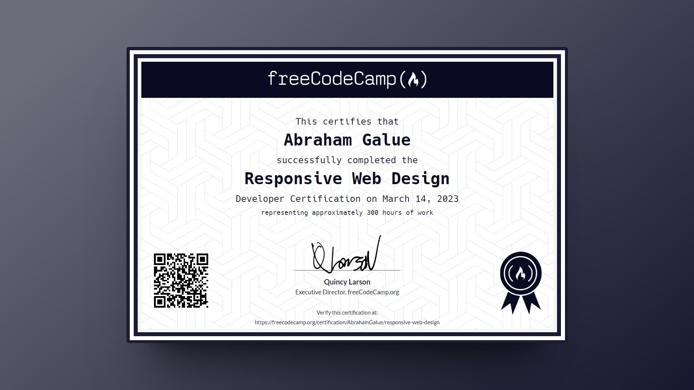

# 🔥 freeCodeCamp: Responsive Web Design Certification

### Certificado de freeCodeCamp

> 🗝 Puedes verificar aquí la veracidad de mi [**certificado**](https://www.freecodecamp.org/certification/AbrahamGalue/responsive-web-design).

## 🚀 Descripción

Este es mi repositorio de proyectos con los cuales conseguí la **certificación de freeCodeCamp** en su nuevo curso de Diseño Web Responsive. Espero que te pueda ayudar.

## 🎭 Proyectos

Los **proyectos principales** para obtener el certificado y que se incluyen son:

- Survey Form
- Tribute Page
- Technical Documentation Page
- Product Landing Page
- Personal Portfolio Webpage
